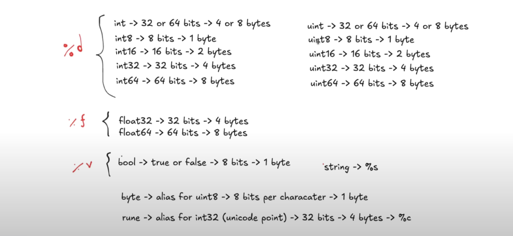

# In Go (Golang), a data type tells the compiler what kind of data a variable can hold — like numbers, text, or true/false.



# Types of Go data Types
1. **Bolean types**
   They are boolean types and consists of the two predefined constants: **(a) true (b) false**

2. **Numeric types**
   They are again arithmetic types and they represents a) integer types or b) floating point values throughout the program.

3. **String types**
   A string type represents the set of string values. Its value is a sequence of bytes. Strings are immutable types that is once created, it is not possible to change the contents of a string. The predeclared string type is string.
   ```go
   str := "Hello"
   str[0] = 'M' // ❌ This will give a compile-time error
   You cannot modify str[0] because Go strings are immutable.
   ```

4. **Derived types**
   They include (a) Pointer types, (b) Array types, (c) Structure types, (d) Union types and (e) Function types (f) Slice types (g) Interface types (h) Map types (i) Channel Types

**Array types and structure types are collectively referred to as aggregate types. The type of a function specifies the set of all functions with the same parameter and result types.**

**--------------------------------------------------------------------------------------------------------------------**

# Boolean Types
In Go, bool is the single type representing Boolean values. It is widely used in logical and conditional operations. It can accept only two values which are "true" or "false".
```go
package main

import "fmt"

func main() {
    // Declare boolean variables
    var var1 bool = true
    var var2 bool = false

    // Print boolean values
    fmt.Println("var1:", var1)
    fmt.Println("var2:", var2)

    // Use boolean in a conditional statement
    if var1 {
        fmt.Println("It's true.")
    } else {
        fmt.Println("It's false")
    }
}
```
```bash
var1: true
var2: false
It's true.
```
### ***🔒 Default value:**
If you declare a bool without assigning a value, it will be false by default.

```go
var isRunning bool
fmt.Println(isRunning) // false
```

**--------------------------------------------------------------------------------------------------------------------**

# Numeric Types
## Integer Types
```md
| Sr.No. | Type    | Description                                   |
|--------|---------|-----------------------------------------------|
| 1      | `uint8`  | Unsigned 8-bit integers (0 to 255)            |
| 2      | `uint16` | Unsigned 16-bit integers (0 to 65535)         |
| 3      | `uint32` | Unsigned 32-bit integers (0 to 4294967295)    |
| 4      | `uint64` | Unsigned 64-bit integers (0 to 18446744073709551615) |
| 5      | `int8`   | Signed 8-bit integers (-128 to 127)           |
| 6      | `int16`  | Signed 16-bit integers (-32768 to 32767)      |
| 7      | `int32`  | Signed 32-bit integers (-2147483648 to 2147483647) |
| 8      | `int64`  | Signed 64-bit integers (-9223372036854775808 to 9223372036854775807) |
```
**int**	Depends on system (32/64 bits)
**uint**	System-dependent
**uint**	System-dependent

**Example**<br>
The following is an example of how the integer types are used in Go:
```go
package main

import "fmt"

func main() {
    // Unsigned integers
    var u8 uint8 = 255
    var u16 uint16 = 65535

    // Signed integers
    var i8 int8 = -128
    var i16 int16 = 32767

    // Printing values
    fmt.Println("Unsigned 8-bit integer (uint8):", u8)
    fmt.Println("Unsigned 16-bit integer (uint16):", u16)
    fmt.Println("Signed 8-bit integer (int8):", i8)
    fmt.Println("Signed 16-bit integer (int16):", i16)
}
```
```bash
Unsigned 8-bit integer (uint8): 255
Unsigned 16-bit integer (uint16): 65535
Signed 8-bit integer (int8): -128
Signed 16-bit integer (int16): 32767
```
## ⚠️ Important Notes:
- Use **signed types** when you expect negative values.
- Use **unsigned types** if you know the value can't be negative — e.g., file sizes, memory addresses.
- Be cautious mixing **signed and unsigned types** in expressions.

**--------------------------------------------------------------------------------------------------------------------**

## Floating-Point and Complex Types

| Sr.No. | Type        | Description                                                  |
|--------|-------------|--------------------------------------------------------------|
| 1      | `float32`    | IEEE-754 32-bit floating-point numbers                       |
| 2      | `float64`    | IEEE-754 64-bit floating-point numbers                       |
| 3      | `complex64`  | Complex numbers with `float32` real and imaginary parts      |
| 4      | `complex128` | Complex numbers with `float64` real and imaginary parts      |

> **Note:** The value of an *n*-bit integer is *n* bits and is represented using two's complement arithmetic operations.<br>
> 🔍 **float64** is the default for floating-point numbers in Go.

**Example**
The following is an example of how the float types are used in Go:
```go
package main

import "fmt"

func main() {
    var pi float32 = 3.14159
    var e float64 = 2.718281828459045

    var firstComplexNumber complex64 = complex(1.0, 2.0)
    var secondComplexNumber complex128 = complex(3.0, 4.0)

    // Printing values
    fmt.Println("Value of pi (float32):", pi)
    fmt.Println("Value of e (float64):", e)
    fmt.Println("First complex number (complex64):", firstComplexNumber)
    fmt.Println("Second complex number (complex128):", secondComplexNumber)

    // Printing real and imaginary parts
    fmt.Println("Real part of first complex number:", real(firstComplexNumber))
    fmt.Println("Imaginary part of first complex number:", imag(firstComplexNumber))

    fmt.Println("Real part of second complex number:", real(secondComplexNumber))
    fmt.Println("Imaginary part of second complex number:", imag(secondComplexNumber))
}
```
```bash
Value of pi (float32): 3.14159
Value of e (float64): 2.718281828459045
First complex number (complex64): (1+2i)
Second complex number (complex128): (3+4i)
Real part of first complex number: 1
Imaginary part of first complex number: 2
Real part of second complex number: 3
Imaginary part of second complex number: 4
```
**⚠️ Key Points:**
- Use **float32** when memory is a concern.
- Prefer **float64** for most accurate calculations.
- Be aware of floating-point **rounding errors** (they're not always 100% precise).

**--------------------------------------------------------------------------------------------------------------------**
## Other Numeric Types
There is also a set of numeric types with implementation-specific sizes −

| Sr.No. | Type     | Description                                                  |
|--------|----------|--------------------------------------------------------------|
| 1      | `byte`    | Same as `uint8`                                              |
| 2      | `rune`    | Same as `int32`                                              |
| 3      | `uint`    | Either 32 or 64 bits (architecture-dependent)                |
| 4      | `int`     | Same size as `uint` (architecture-dependent)                 |
| 5      | `uintptr` | Unsigned integer used to store the uninterpreted bits of a pointer |

**-------------------------------------------------------------------------------------------------------------------**
# Derived Types
In Go language, the derived data types are based on other types. They can be created with the help of other data types.
Here are the most commonly used derived types in Go:

| Type      | Description                                                    |
|-----------|----------------------------------------------------------------|
| `Array`   | A fixed-size sequence of elements of the same type.            |
| `Slice`   | A dynamically-sized, more flexible view into arrays.           |
| `Map`     | A key-value pair collection (like a dictionary).               |
| `Struct`  | A collection of fields, often used to represent records.       |
| `Pointer` | A variable that stores the memory address of another variable. |
| `Function`| Functions themselves are also types.                           |
| `Interface` | Specifies method signatures (used for abstraction).          |
| `Channel` | Used for communication between goroutines (concurrency).       |

## Pointer Types
The pointer data type stores the memory address of another variable.
Here is an example of pointer type:
```go
package main

import "fmt"

func main() {
	var x int = 42
	var ptr *int = &x
	fmt.Println(*ptr)
}
```
```bash
42
```
------------------------------------------------------------------------------------------------------------------------

## Array Types
The array data type is a fixed-size sequence of elements of the same type. It is used to store multiple values of the same data type in a variable.

Here is an example of array type:
```go
package main

import "fmt"

func main() {
	var arr [3]int = [3]int{10, 22, 31}
	fmt.Println(arr)
}
```
```bash
[10 22 31]
```
------------------------------------------------------------------------------------------------------------------------
## Structure Types
The structure (struct) data type is a collection of fields, each with a name and a type. The structure type allows you to store different types of values.

Here is an example of structure type:
```go
package main

import "fmt"

func main() {
   type Student struct {
      Name string
      Age  int
   }
   var std Student = Student{"Prakash Joshi", 30}
   fmt.Println(std)
}
```
```bash
{Prakash Joshi 30}
```
------------------------------------------------------------------------------------------------------------------------

## Union Types
Go language does not provide the support of unions, but unions can be used as interface{} to hold any type of value.

Here is an example:
```go
package main

import "fmt"

func main() {
   var u interface {} = "Prakash Joshi"
   fmt.Println(u)
   u = 30
   fmt.Println(u)
   u = "Teja"
   fmt.Println(u)
}
```
```bash
Prakash Joshi
30
Teja
```
-----------------------------------------------------------------------------------------------------------------------

## Function Types
The function is used for organizing and structuring the code, allowing grouping of the related code together in purpose to make it reusable and easy to maintain.

Here is an example:
```go
package main

import "fmt"

func main() {
    var AddTwoNums = func(a, b int) int { 
        return a + b 
    }
    
    // Calling
    fmt.Println(AddTwoNums(10, 20))  
}
```
```bash
30
```
------------------------------------------------------------------------------------------------------------------------

## Slice Types
In Go language, the slice type is a dynamically sized and flexible view of an array.

Here is an example:
```go
package main

import "fmt"

func main() {
    var arr []int = []int{11, 22, 33, 44}
    fmt.Println(arr) 
}
```
```bash
[11 22 33 44]
```
-----------------------------------------------------------------------------------------------------------------------

## Map Types
The map data type is an unordered collection of key-value pairs.

Here is an example to demonstrate how you can use the map data type in Go:
```go
package main

import "fmt"

func main() {
    // Creating a map to store 
    // country names and their country codes
    var countryCodes = map[string]string{
        "USA":    "+1",
        "India":  "+91",
        "China":  "+86",
        "Brazil": "+55",
        "UK":     "+44",
    }

    // Printing the map
    fmt.Println(countryCodes)

    // Accessing a specific country's code
    fmt.Println("Country code for India:", countryCodes["India"])
}
```
```bash
map[Brazil:+55 China:+86 India:+91 UK:+44 USA:+1]
Country code for India: +91
```

----------------------------------------------------------------------------------------------------------------------

## Channel Types
The channels are useful when you are working with goroutines; these types are used for communication between goroutines.

Here is an example to demonstrate how you can use the channels in Go:
```go
package main

import "fmt"

func main() {
    ch := make(chan int)
    go func() { ch <- 42 }()
    fmt.Println(<-ch)  
}
```
```bash
42
```
